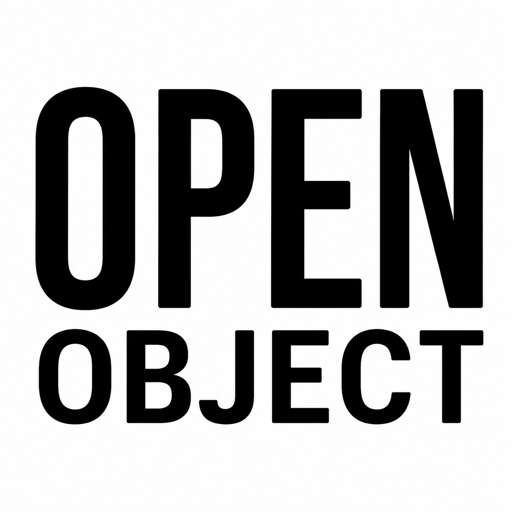

<p align="center">
  
</p>

# OpenObject

Self-hosted replacement software for the **Infinite Objects XXL** — the 26" square
digital art frame whose original "White Walls" cloud software has decayed.
OpenObject wipes the frame's built-in mini PC and turns it into a clean, **local**
art player: it shows your own images and videos, is controlled from a web page in
any browser, and **depends on no external service**.

> **Status — early development.** The web app (control panel + display) is being
> built and tested on macOS first; the Linux/kiosk image and bootable USB installer
> come once bench hardware is in hand. This repo is **private for now**, intended to
> go public to help other stranded XXL owners revive their units.

## Why
The XXL is a normal x86 mini PC (a **MeLE Quieter 3Q**) behind a square panel — not
a sealed appliance. When the vendor went quiet, perfectly good hardware was left
showing error screens. OpenObject is a software reflash that brings it back, with
two commitments:

1. **Self-contained on the player.** The mini PC is the always-on brain. Your
   Mac/phone are just where files come *from* and a browser to control it.
2. **Revivable by the next owner.** This is meant as a shareable kit, so *anyone*
   with a stranded XXL can follow along.

## What it does (v1)
- Displays **JPEG, PNG, GIF, WebP, AVIF, MP4, MOV**, edge-to-edge on the square
  panel — no frame, no border.
- **Library + Rotation + Pin:** everything you upload is kept; you choose what's in
  the cycle and in what order (**sequence / shuffle / random**), and can pin one
  piece to hold permanently.
- **Per-clip control:** hold duration, and **Fit** (whole image — the default) vs
  **Fill** (crop to fill the square).
- **Animated art and video always loop** to fill their time — never freeze on the
  first frame. Silent by design.
- **Sleep hours** to blank the panel overnight.
- Add art by **dragging files onto the control panel** from any device — no
  accounts, no cloud.

## Hardware target
|              |                                                                    |
| ------------ | ------------------------------------------------------------------ |
| Frame        | Infinite Objects XXL (26", 1:1 square)                             |
| Player       | MeLE Quieter 3Q — Intel Celeron N5100 (x86-64), Wi-Fi + Gigabit    |
| Video path   | Captive HDMI from the mini PC to the panel — untouched by reflash  |

## Repository layout
```
docs/        engineering spec (HANDOFF) + casual-user SETUP-GUIDE + appendix
player/      the OpenObject web app (Node + SQLite) — Phase 1
installer/   bootable USB build — Phase 2 (hardware)
assets/      branding (the OpenObject mark)
```

## Documentation
- **[Setup Guide](docs/SETUP-GUIDE.md)** — for owners reviving a unit (no engineering).
- **[Handoff / Build Spec](docs/HANDOFF.md)** — the full engineering spec + decision log.
- **[White Walls reset appendix](docs/appendix-whitewalls-reset.md)** — restoring the
  *original* software, for owners who want it back.

## License
_To be chosen before this repo goes public._
